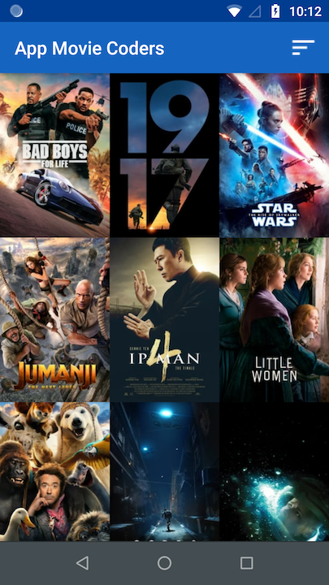
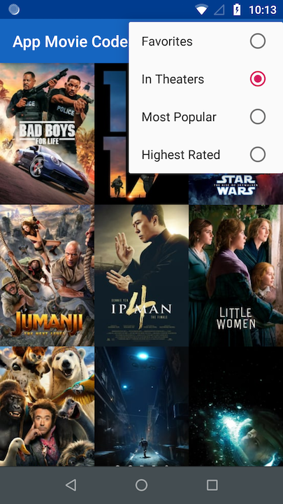
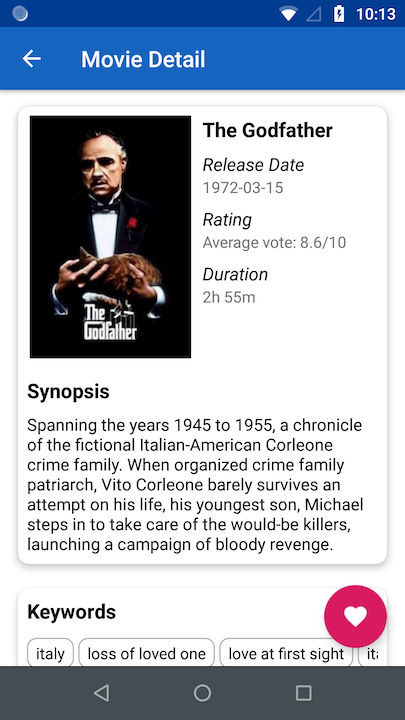
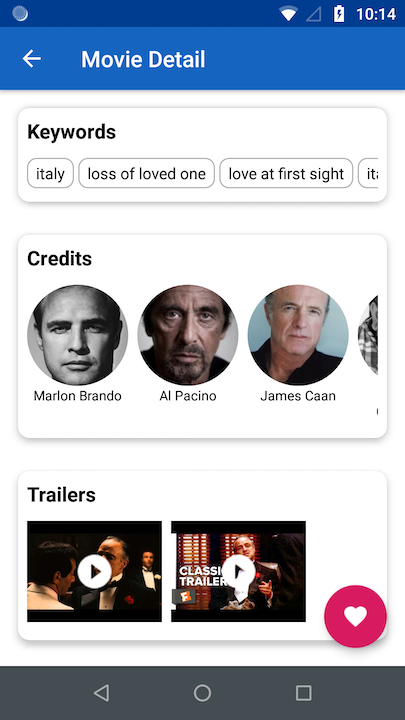
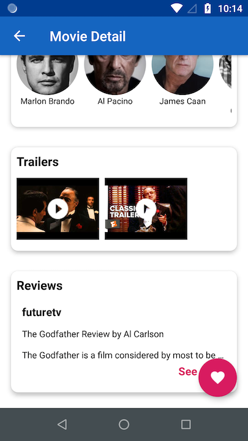
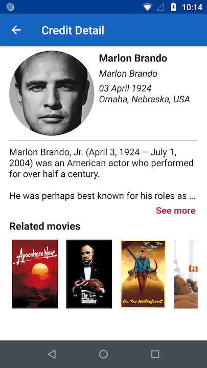

# App Movie Coders

This is a project for the Architect Coders' Training. With this application users can discover popular and recent movies.

## Screenshots

## User Experience

In this project I built the next features:

* A grid arrangement of movie posters.
* A menu to change sort order (Favorites, In Theater, Most popular or Top rated).
* A detail screen to show additional information (Title, Movie poster, Plot synopsis, User rating, Release date, Keywords, Trailers & Reviews).
* A detail screen to show credit detail (Name, born, biography, related movies).
* An option to save your favorite movies.

## Implementation Guidance

### Working with the themoviedb.org API

This project implements The Movie DB API to provide a movie information list.

If somebody wants to use this project it's necessary to create an API KEY TheMovieDB site and add it in *gradle.properties*.

Example:

MOVIE_DB_API_KEY = "XXXX"

### Architecture - Android Architecture Components

This project follows The Clean Architecture's rules for making a independent, testable and maintainable code.

#### Layers

* Presentation: UI & View Models.
* Use Cases: GetPopularMovieListUseCase, GetFavoriteMovieListUseCase, etc.
* Domain: Movie, Trailer, Review, etc.
* Data: MovieRepository, RegionRepository, etc.
* Framework: Room, Retrofit, etc

This project uses ViewModel to store and manage data, communicating changes to UI.

This project uses LiveData in order to manage navigation and values in the application. Also, livedata's implementation is used it for observing changes in database and updating UI.

### Data Persistence - Room

This project uses Room for saving user's favorite movies.

### Request Manager - Retrofit

This project uses Retrofit in order to provide movie list and its information from provided network resource.

### Image Library - Glide

This project uses Glide in order to load movie posters. To use place holders I added icons from Material Design Icons.

### Permission Manager - Dexter

This project uses Dexter in order to manage permissions at runtime.

### Dependency Injection - Dagger

This project uses Dagger in order to manage dependency injection.

### Dependency Injection (Service Locator Pattern) - Koin

This project uses Koin in order to generate mocks for integration tests.

### Unit and Integration Tests - JUnit, Mockito

This project uses JUnit and Mockito in order to create tests for use cases, data and view models.

### UI Tests - JUnit, Mockito, KoinTest, MockWebServer

This project uses a set of tools in order to create ui tests for specifically flows.

## Improvement

This project will implement the next features:

* Log in with Firebase.
* Lint
* Continuous Integration with Bitrise.
